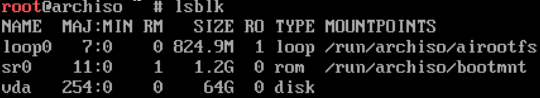
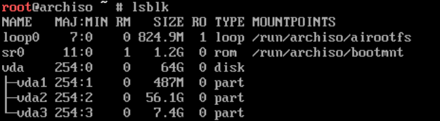
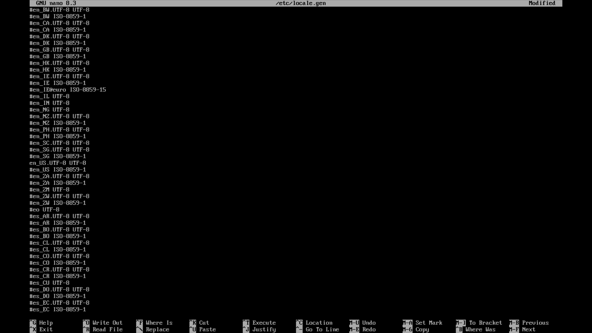
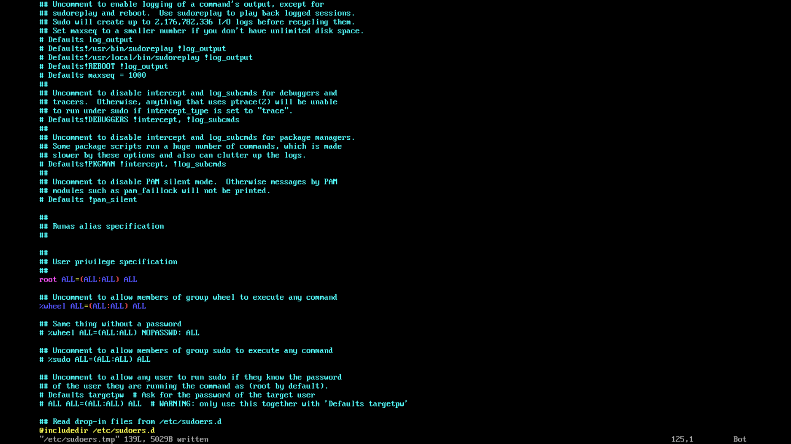

Arch Linux is a general-purpose GNU/Linux distribution that uses a rolling-release model.

The default installation is a minimal base system which can be configured by the user to add what they need.

This blog post will guide you on how to install Arch Linux.

## 1. Prequisites

Before we start, make sure that you have prepared the following:

- A USB stick
- A working internet connection
- UEFI

I know that you have at least one of them.

## 2. Download the Arch Linux ISO

You can download the latest Arch Linux ISO [here](https://archlinux.org/download).

## 3. Create an Arch Linux live USB

### 3.1. Using balenaEtcher

The recommended way to create an Arch Linux live USB is through an app called **balenaEtcher**. It is available for Windows, MacOS and Linux.

You can download balenaEtcher [here](https://etcher.balena.io)

### 3.2. Using dd

Alternatively, for those using GNU/Linux, you can use the `dd` command instead. Replace `path/to/archlinux-version-x86_64.iso` with the path to your Arch Linux ISO and `/dev/sdX` to your USB drive. You can find that information using the `lsblk` command.

```bash
dd bs=4M if=path/to/archlinux-version-x86_64.iso of=/dev/sdX conv=fsync oflag=direct status=progress
```

## 4. Booting into your Arch Linux live ISO

Reboot into your BIOS, typically by holding F2, F10 or DEL during boot. Before booting into the live USB, disable **secure boot** as the default Arch Linux ISO does not support it.

After that, find the USB drive in your boot menu and boot it up.

## 5. Set the console keyboard layout

The default console keyboard layout is US, you can find yours with `localectl list-keymaps`.

To switch console keyboard layout, use the command below. Replace `keymap` with your desired keyboard layout.

```bash
loadkeys keymap
```

## 6. Connecting to your Wifi (optional)

If you don't have an ethernet connection, you can use the `iwctl` command to connect to your wifi network.

You can follow this section of the ArchWiki [here](https://wiki.archlinux.org/title/Iwd#Connect_to_a_network).

## 7. Partition your disk

Now come the real juicy part, the actual installation!

### 7.1. Find your disk

Use the `lsblk` command to list all of your drives and partitions.



### 7.2. Create a new partition table

After choosing which disk to install Arch Linux on, you'll wanna create a new partition table using the following command. Replace `disk_name` with your disk's. For instance, mine is `vda`.

**CAUTION**: This command will wipe *everything* on the disk, make sure you type in the correct one.

```bash
parted /dev/disk_name -- mklabel gpt
```

For convenience sake, I will now refer to `/dev/disk_name` as `/dev/vda`.

### 7.3 Partition your disk

First, create a **EFI system partition**, this partition is responsible for booting into your Arch Linux installation.

```bash
parted /dev/vda -- mkpart ESP fat32 1mb 512mb
parted /dev/vda -- set 1 esp on
```

Next, create a **root partition**, this partition will be where Arch Linux is installed to.

```bash
parted /dev/vda -- mkpart root btrfs 512mb -8GB
```

Finally, create a **swap partition**, this partition will be used as additional memory in case you run out of memory. This is similar to Windows's page file.

```bash
parted /dev/vda -- mkpart swap linux-swap -8GB 100%
```

Now that we've created these partitions, your disk should looks like this:



### 7.4. Format your partitions

Once the partitions have been created, they must be formatted with the appropriate filesystem.

First, format the **boot partition** with **FAT32**.

```bash
mkfs.fat -F 32 /dev/vda1
```

Next, format the **root partition** with **btrfs**.

```bash
mkfs.btrfs /dev/vda2
```

Finally, format the **swap partition**.

```bash
mkswap /dev/vda3
```

### 7.5. Mount the filesystems

First, mount the **root partition** to `/mnt`.

```bash
mount /dev/vda2 /mnt
```

Next, mount the **boot partition** to `/mnt/boot`.

```bash
mount /dev/vda1 -m /mnt/boot
```

Finally, activate the swap partition.

```bash
swapon /dev/vda3
```

## 8. Install Arch Linux

After mounting those filesystems, we can *finally* install Arch Linux.

### 8.1. Select the mirrors (optional)

Before we install Arch Linux, we can specify which mirrors to download packages from, resulting in a much faster download speed.

Arch Linux uses `/etc/pacman.d/mirrorlist` to determine which mirrors to download from. To configure that, we'll be using the `reflector` command. Replace `country_name` with your country (ex: US, China, Singapore, etc).

```bash
reflector -c country_name --sort rate --save /etc/pacman.d/mirrorlist
```

This command will fetch mirrors from `country_name`, sort them by download speed and save the result in `/etc/pacman.d/mirrorlist`.

### 8.2. Install essential packages

We will now use the `pacstrap` command to install necessary packages.

**NOTE**: If you have an AMD cpu, replace `intel-ucode` with `amd-ucode`.

```bash
pacstrap -K /mnt base linux linux-firmware sof-firmware base-devel intel-ucode efibootmgr networkmanager nano
```

## 9. Configure your system

Now that Arch Linux is installed, we can configure the system.

### 9.1. Generate an fstab file

The **fstab** file define how disk partitions and various other block devices should be mounted into the filesystem.

We can generate an **fstab** file with the `genfstab` command.

```bash
genfstab -U /mnt > /mnt/etc/fstab
```

### 9.2. Enter your Arch Linux installation

We can now enter the Arch Linux installation using the `arch-chroot` command.

```bash
arch-chroot /mnt
```

### 9.3. Set your timezone

Now we need to set the timezone to your place's TZ identifier.

If you don't know your timezone's TZ identifier, you can find a list of them [here](https://en.wikipedia.org/wiki/List_of_tz_database_time_zones).

We can then symlink the timezone to `/etc/localtime`. Replace `Region/City` with your TZ identifier.

```bash
ln -sf /usr/share/zoneinfo/Region/City /etc/localtime
```

Since I live in Vietnam, the command would be:

```bash
ln -sf /usr/share/zoneinfo/Asia/Ho_Chi_Minh /etc/localtime
```

### 9.4. Set your locale and keyboard layout

Edit `/etc/locale.gen` and uncomment (remove the # behind the text) `en_US.UTF-8 UTF-8` and other locales if needed.

```bash
nano /etc/locale.gen
```

It should look like this:



Now save by using `CTRL+S` and exit by using `CTRL+X`

After that, we can generate the locales by using the `locale-gen` command.

```bash
locale-gen
```

We then need to set the locale to `en_US.UTF-8` by writing to `/etc/locale.conf`

```bash
echo LANG=en_US.UTF-8 > /etc/locale.conf
```

Now we need to set our keyboard layout by writing to `/etc/vconsole.conf`. Replace `keymap` to the one you used in **step 5**.

```bash
echo KEYMAP=keymap > /etc/vconsole.conf
```

### 9.5. Name your PC

To name your PC, we need to write to the `/etc/hostname` file. Replace `name` with your desired name.

**IMPORTANT:** Do not add spaces in your pc's name. Do not add more than 1 dash to your pc's name. Your pc's name must not start with a dash.

```bash
echo name > /etc/hostname
```

### 9.6. Set root password

Set the root password using the `passwd` command.

```bash
passwd
```

### 9.7. Create new user

Create a new user and add it to group `wheel` by using the `useradd` command. Replace `name` with your desired username.

```bash
useradd -mG wheel name
```

Set user's password with `passwd`.

```bash
passwd name
```

### 9.8. Enable sudo for group wheel

We can allow users to use the `sudo` command by editing `/etc/sudoers`

It is important that this file is free of syntax errors, so we need to use the `visudo` command to edit the file.

```bash
EDITOR=nano visudo
```

In this file, we need to uncomment `%wheel ALL=(ALL:ALL) ALL`. You can find this line at near the end of the file.

The end result should looks like this:



### 9.9. Enable NetworkManager

To handle network connections, we need to enable `NetworkManager` using the `systemctl` command.

```bash
systemctl enable NetworkManager
```

### 9.10. Install and configure the bootloader

Our Arch Linux installation is pretty much ready, but to actually boot into it, we need to install a bootloader.

For this tutorial, we will be installing `systemd-boot`.

#### 9.10.1. Install systemd-boot

To install systemd-boot, we can use the following command.

```bash
bootctl install
```

#### 9.10.2. Configure systemd-boot

Now that systemd-boot is installed, we can configure it to show Arch Linux on start.

Start by editing `/boot/loader/loader.conf`.

**TIP:** You can replace `arch.conf` with `@saved` to remember the last boot entry on startup.

```bash
default arch.conf
timeout 5
console-mode max
editor no
```

Finally, we'll need to create our Arch boot entries by creating 2 files in `/boot/loader/entries/`.

`/boot/loader/entries/arch.conf`

```conf
title Arch Linux
linux /vmlinuz-linux
initrd /initramfs-linux.img
options root=/dev/vda2 rw
```

`/boot/loader/entries/arch-fallback.conf`

```conf
title Arch Linux
linux /vmlinuz-linux
initrd /initramfs-linux-fallback.img
options root=/dev/vda2 rw
```

### 9.11. Before you boot (optional)

We can install a desktop environment before booting into our Arch Linux installation.

For this tutorial, we will be installing KDE Plasma.

```bash
pacman -S plasma kde-applications sddm
systemctl enable sddm
```

For other desktop environments, refers to the [ArchWiki](https://wiki.archlinux.org/title/Desktop_environment).

### 9.12. Finishing up

Now, exit the Arch Linux installation, unmount all the mounted partitions and reboot.

```bash
exit
umount -a
reboot
```

Congratulations! You now have a working Arch Linux installation.
